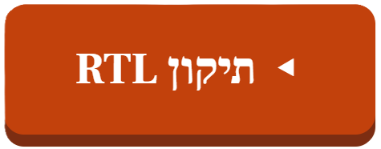

# RTL Fix 🔧

[](LICENSE)
[](https://ori-halevi.github.io/hebrew-rtl-web-fix/)

> תיקון כיווניות עברית בכל דף אינטרנט — בלחיצה אחת.
> One-click Hebrew/RTL text direction fix for any web page.

<p align="center">
  
</p>

---

## עברית

### מה זה?

לפעמים אתרים מציגים טקסט עברי בכיווניות שגויה — שמאל לימין במקום ימין לשמאל,
או יישור הפוך. **RTL Fix** הוא *bookmarklet* קטן שמתקן את זה בלחיצה אחת,
על כל דף, בלי להתקין שום דבר.

לחיצה אחת — מתקן. לחיצה נוספת — מחזיר למצב המקורי.

### התקנה (הדרך הקלה)

1. היכנסו לדף ההתקנה: **<https://ori-halevi.github.io/hebrew-rtl-web-fix/>**
2. גררו את הכפתור הכתום לשורת הסימניות של הדפדפן.
3. זהו. בכל דף בעייתי — לחצו על הסימנייה.

### התקנה ידנית

אם הגרירה לא עובדת, צרו סימנייה חדשה והדביקו את הקוד הבא בשדה הכתובת:

```js
javascript:(function(){var e=document.getElementById('rtl-fix-style');if(e){e.remove();}else{var s=document.createElement('style');s.id='rtl-fix-style';s.innerHTML='p,li,h1,h2,h3,h4,h5,h6,span,div{unicode-bidi:isolate;direction:rtl;text-align:right;}';document.head.appendChild(s);}})();
```

### איך זה עובד?

ה-bookmarklet מזריק תגית `<style>` שמכריחה את רכיבי הטקסט בדף
(`p`, `li`, כותרות, `span`, `div`) לקבל `direction: rtl`, יישור לימין,
ו-`unicode-bidi: isolate` למניעת ערבוב מבלבל של עברית ואנגלית.
התגית מסומנת במזהה ייחודי, כך שלחיצה חוזרת פשוט מסירה אותה.

> ⚠️ הסלקטור מכוון בכוונה רחב — הוא תופס את כל רכיבי הטקסט הנפוצים בדף.
> אם משהו נראה מוזר אחרי הלחיצה, פשוט לחצו שוב לביטול.

---

## English

### What is it?

Some sites render Hebrew (or other RTL) text in the wrong direction.
**RTL Fix** is a tiny *bookmarklet* that corrects this on any page with a
single click — no extension, no signup, no setup.

Click once to apply, click again to revert.

### Installation (the easy way)

1. Open the install page: **<https://ori-halevi.github.io/hebrew-rtl-web-fix/>**
2. Drag the orange button onto your browser's bookmarks bar.
3. Done. On any broken page, click the bookmark.

### Manual installation

Create a new bookmark and paste this into the URL field:

```js
javascript:(function(){var e=document.getElementById('rtl-fix-style');if(e){e.remove();}else{var s=document.createElement('style');s.id='rtl-fix-style';s.innerHTML='p,li,h1,h2,h3,h4,h5,h6,span,div{unicode-bidi:isolate;direction:rtl;text-align:right;}';document.head.appendChild(s);}})();
```

### How it works

The bookmarklet injects a `<style>` tag that forces text elements to use
`direction: rtl`, right alignment, and `unicode-bidi: isolate`. The tag
carries a unique id, so clicking again simply removes it — a clean toggle.

> ⚠️ The selector is intentionally broad — it catches all common text
> elements on the page. If something looks off after clicking, just
> click again to revert.

---

## Credits / קרדיטים

תודה ל-[**@JJKFHG**](https://t.me/JJKFHG) מטלגרם — שממנו הגיעו הרעיון
והגרסה הראשונית של הקוד. הפרויקט הזה הוא שיפור וליטוש של מה שהוא שלח.

Big thanks to [**@JJKFHG**](https://t.me/JJKFHG) on Telegram for the
original idea and initial code. This project is a polished version of
what he shared.

---

## Project structure

| File | Purpose |
|------|---------|
| `index.html` | Drag-to-install landing page (hosted via GitHub Pages) |
| `bookmarklet.js` | Human-readable source of the bookmarklet |
| `assets/button-preview.png` | Preview of the install button |
| `README.md` | This file |
| `LICENSE` | MIT License |

## For developers / forking this repo

To host your own copy on GitHub Pages: in your fork go to
`Settings → Pages`, and pick the main branch as the source. Your page
will be live at `https://USERNAME.github.io/REPO/`.

## License

MIT — free to use, modify, and share.
